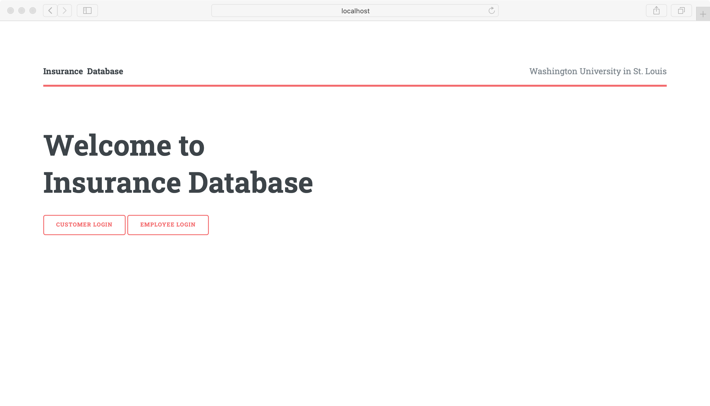
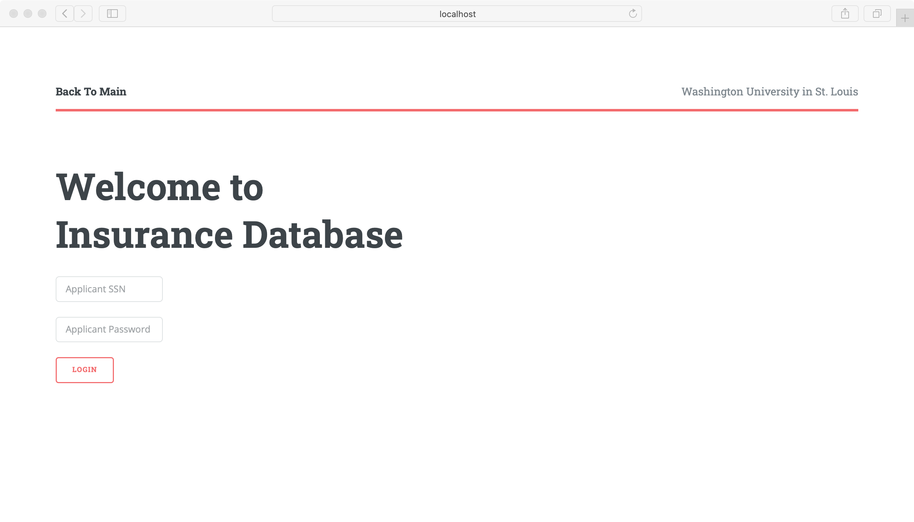
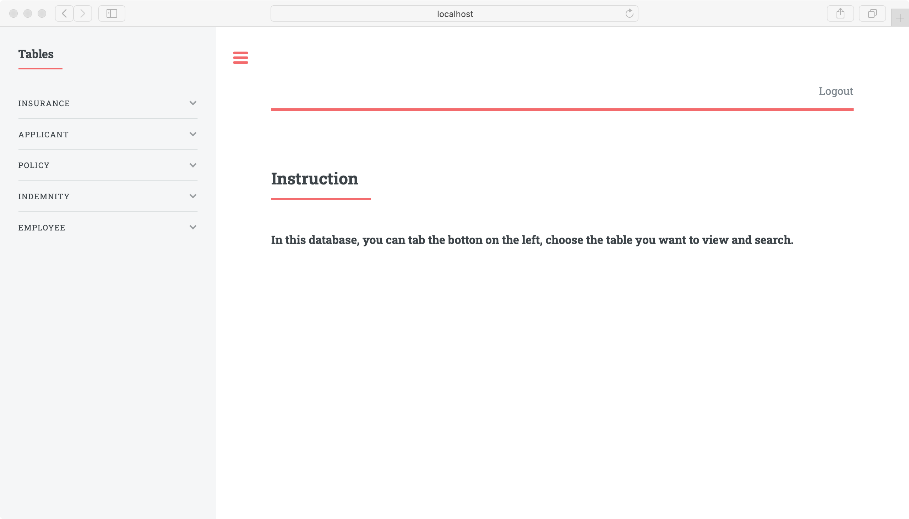
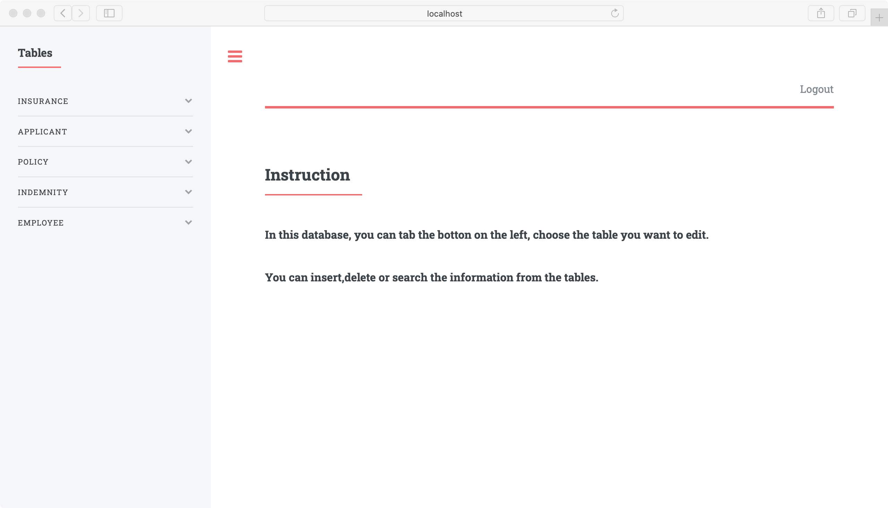
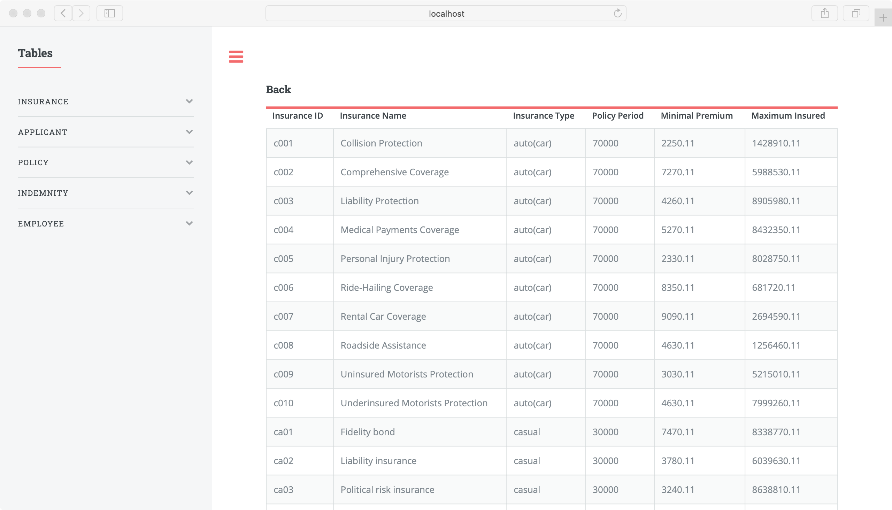
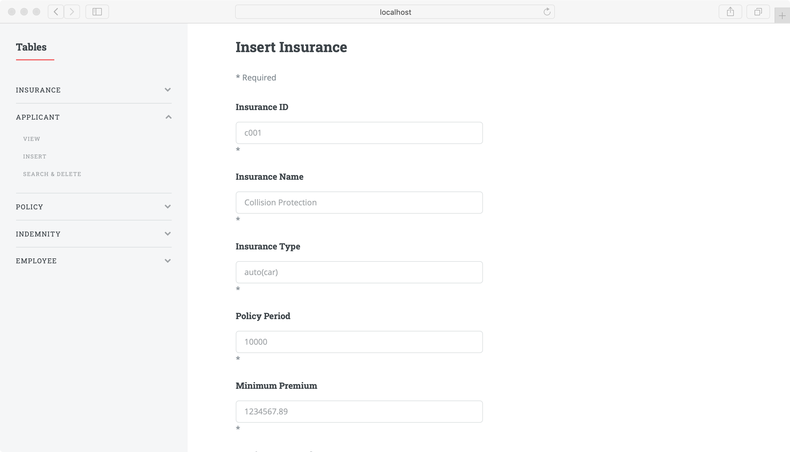
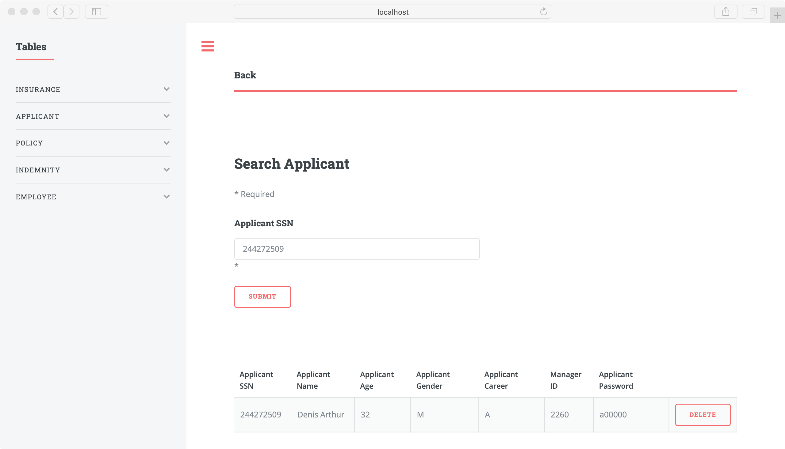

# Insurance Database

This project is about a commercial insurance database that provides a complete one-stop solution for insurance companies, customers and researchers. It stores insurance, customers, account managers and related customer insurance records and claims records.
Main goals of this project includes helping managing data for administrators, facilitating customers to look up information, assisting salesman seek and update data more easily, and providing a platform for sharing real-time data, as well as creating visualization type of data.

## Built With

1. HTML
2. CSS
3. jQuery
4. php
5. MySQL
6. MAMP

## DEMO

